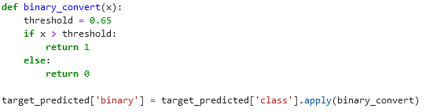

# Discussion topics part 3

## The AWS-lesson

1. You want to detect fraud in future transactions. You can work with 1.000.000 past transactions of which 2.53% is labeled as fraudulent. Which problem will you be facing? Imbalanced classification because only 2.53% is fraudulent and all the other is not fraudulent. Algorithms bias the class they see more off.
1. Could I use an Amazon S3 bucket as a sort of google drive for my personal files? Yes, you can use an Amazon S3 bucket to store your personal files in a similar way to using Google Drive for personal file storage. But cant share them.
1. Give some pros and cons for Amazon FSx.
   Pros: Windows based, Security and Redundancy, Supports wide range of OS, Pay-as-you-go
   Cons: Cost, Complexity
1. Give some pros and cons for Amazon EFS.
    Pros: Easy to use, Scalability, shared access, compatability

        Cons: Cost, Performance
1. What is Amazon RDS? Amazon Relational Database service
    A:  It is designed to simplify the setup, operation, and scaling of relational databases and uses several relational database engines.
1. What is Amazon Redshift?
    A: Amazon Redshift is a cloud-based data warehousing service by Amazon Web Services (AWS) for fast and efficient data storage and analysis. It's used for processing large datasets and running analytics.
1. What would a usecase for Amazon Timestream be?
    A: IoT Applications and DevOps Systems
1. What is the service that amazon uses to keep data safe - i.e. that not anybody can access it? (IAM)
    A: Amazon uses IAM (Identity and Access Management) to control access to data and services, ensuring that only authorized users or resources can access them.
1. What is CloudTrail?
    A: helps you enable operational and risk auditing, governance, and compliance of your AWS account
1. Explain: feature selection, feature extraction and feature creation.
    A: Feature Selection: Choosing the most relevant and informative features from the original dataset to improve model performance and reduce complexity.

    Feature Extraction: Transforming the original features into a new set of features to capture essential information while reducing dimensionality, often using techniques like Principal Component Analysis (PCA).

    Feature Creation: Generating new features from existing ones or external sources to provide additional information that can improve model performance, such as creating a "total sales" feature from "quantity" and "price" features in a sales dataset.

1. Why can't we just encode blue as 1 and red as 2? 
    A: Then what should we do? By using 1 and 2 you create an order, you should instead use one hot encoding
1. When doing feature selection, you might use wrapper methods or filter methods. What are the [dis]advantages of both?
    A: Wrapper Methods:

    Advantages: More accurate but computationally expensive, model-specific.
    Disadvantages: Slower, prone to overfitting, model-specific.
    Filter Methods:

    Advantages: Fast, model-agnostic, reduced overfitting risk.
    Disadvantages: May miss complex relationships, limited to statistical measures, not guaranteed to optimize model performance.

1. Explain the different sets in which you split your data. (Train, test, validation.)
    A: Train set is the largest set of data which you use to actually train your model.
    Validation set is the set you use to check how good you're model has been trained.
    Test set is the final check to see how good your model is with data it has never seen before.
1. What is K-fold cross validation and when is it used?
    A: K-fold cross-validation is a technique used to evaluate machine learning models by dividing the dataset into K subsets. 
        It helps in assessing performance, tuning hyperparameters, and understanding model variability.
1. Why do we need to randomize data before splitting it in different sets?
    A: The dataset is often ordered in the beginning, if you do not randomize it in the example of the titanic dataset you get a training set of primarily 1st of 2nd class while the test set is primarily 3rd class.
1. What is deploying a model? How do you go about it in AWS?
    A: Deploying a model refers to the process of making a trained machine learning model available for use in a production environment. You can deploy it via Sagemaker.
1. Draw and explain a basic confusion matrix.
    A: A confusion matrix is used to check your predicted values with actual values.
        True Positive (TP): The number of positive instances that are correctly classified as positive.
        False Positive (FP): The number of negative instances that are incorrectly classified as positive.
        True Negative (TN): The number of negative instances that are correctly classified as negative.
        False Negative (FN): The number of positive instances that are incorrectly classified as negative.
1. Draw and explain a basic ROC-curve.
    A: An ROC curve shows how well a binary classification model distinguishes between positive and negative instances at different decision thresholds.
1. In the sagemaker labs, you see the function below. Why the 65%? Why not 50%?
    If you set the threshold higher (e.g., 65%), it typically leads to higher precision (fewer false positives) but lower recall (more false negatives).

## The powerpoint and exercises

1. What is the difference in the type of problems XGBoost and Random Forest can cope with?

    Both XGBoost and Random Forest are decision tree-based ensemble machine learning algorithms that can be used for both classification and regression problems. However, they differ in the way they construct the trees and the type of problems they are particularly good at handling.

1. Explain XGBoost.
    A: XGBoost, which stands for eXtreme Gradient Boosting, is a scalable, distributed gradient-boosted decision tree (GBDT)    machine learning library
1. Explain the linear learner we can find on AWS.
    A: The Linear Learner Algorithm in Amazon SageMaker is a supervised learning algorithm used for solving either classification or regression problems
1. Explain the K-means algorithm we can find on AWS.
    A: The K-means algorithm, available on AWS through Amazon SageMaker, is a popular clustering technique used for unsupervised machine learning tasks. Here's a brief explanation:

    Clustering Algorithm: K-means is a clustering algorithm that groups data points into clusters based on their similarity.

1. Explain the 3-set split in data sets.
    A: See question about different datasets above.
1. "The validation data set as well as the testing set, should follow the same probability distribution as the training data set." Explain.
    A: See answer above.
1. Draw a confusion matrix for a binary classifier, and another for a multiclass classifier.
    A: It is the same with both, a multiclass classifier just has more columns and rows.
1. Sensitivity and specificity: explain, and give an example for when they would be better high.
    A: Sensitivity (also called recall) measures how well a model identifies true positives. High sensitivity is crucial in medical tests to minimize false negatives, ensuring diseases are rarely missed.

    Specificity measures how well a model identifies true negatives. High specificity is vital in airport security, where we want to minimize false alarms for non-threat items to ensure passenger safety and efficiency.
1. Explain thresholds in the context of sensitivity and specificity.
    A: Thresholds in sensitivity and specificity determine when a model classifies data as positive or negative. Lowering the threshold increases sensitivity (captures more true positives) but may raise false positives. Raising the threshold increases specificity (reduces false positives) but may miss some true positives.
1. Describe the best and the worst possible models based on their ROC curves.
    A: Best Possible Model: The best possible model would have an ROC curve that closely follows the top-left corner of the graph. This means it achieves high true positive rates (sensitivity) while maintaining a low false positive rate (1-specificity). The area under the curve (AUC) would be close to 1.0, indicating excellent discrimination between classes. This model makes accurate predictions and minimizes misclassifications.

    Worst Possible Model: The worst possible model would have an ROC curve that is a diagonal line from the bottom-left corner to the top-right corner (the line of no discrimination). This implies that the model's performance is no better than random chance. The AUC would be close to 0.5, indicating that the model's predictions are essentially random. This model provides no useful information and performs poorly in distinguishing between classes.
1. How would you calculate the AUC-ROC? How is it used?
    A: AUC-ROC is calculated by plotting the True Positive Rate (Sensitivity) against the False Positive Rate (1-Specificity) at different classification thresholds. The AUC is the area under this curve.

    It's used to evaluate and compare binary classification models. A higher AUC-ROC value indicates better model performance in distinguishing between positive and negative cases. Typically, an AUC-ROC of 0.5 indicates random performance, while higher values represent better discrimination.

