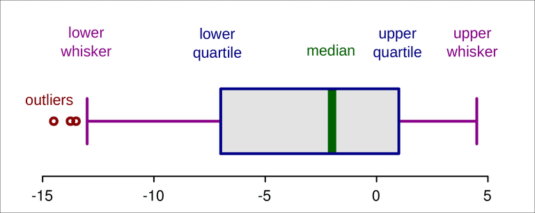

# Outliers

In data science, outliers refer to observations or data points that significantly deviate from the rest of the data. They are extreme values that are distinctively different from the majority of the dataset. Outliers can arise due to various reasons such as measurement errors, data corruption, or genuinely unusual observations in the underlying phenomenon being studied.

Outliers can have a significant impact on data analysis and statistical modeling. They can distort the results of statistical analyses, leading to incorrect conclusions or misleading interpretations. Therefore, it is important to identify and handle outliers appropriately in data science tasks.

# Identification

Outliers can be identified using various techniques. Some common methods include visual inspection of data through scatter plots or __box plots__, statistical methods such as z-score or modified z-score, or using machine learning algorithms specifically designed for outlier detection, such as isolation forests or robust covariance estimation.

# Impact

Outliers can have different impacts depending on the specific analysis being performed. They can affect summary statistics such as mean and standard deviation, leading to biased estimates. Outliers can also influence regression models by pulling the fitted line towards them or significantly affecting the coefficients. Therefore, it is crucial to understand the context and domain knowledge to determine the appropriate treatment for outliers.

# Handling

There are several approaches to handle outliers, and the choice depends on the nature of the data and the goals of the analysis. Some common strategies include:

* Removing outliers: If outliers are due to data entry errors or measurement issues, it may be appropriate to remove them from the dataset. However, this should be done cautiously, as removing genuine outliers can lead to loss of valuable information. This is by far the easiest solution to them.

The following methods are provided for your general information:

* Transformation: Transforming the data using mathematical functions (e.g., logarithm, square root) can help mitigate the impact of outliers by reducing their relative influence.
* Winsorization or clipping: This method involves capping the extreme values at a predefined threshold. Values above or below the threshold are replaced with the nearest valid value within the threshold.
* Robust statistics: Using robust statistical measures that are less affected by outliers, such as median instead of mean or interquartile range instead of standard deviation.
* Creating separate models: In some cases, outliers represent a distinct subset of data that requires separate modeling or analysis. Creating separate models or treating outliers as a separate category can be an appropriate approach.

# Domain knowledge

Understanding the domain and the underlying process that generated the data is crucial in determining how to handle outliers. In some cases, outliers may represent rare but valid observations that carry important insights or provide valuable information about the phenomenon being studied. (For example: the person who paid most on the titanic paid a lot more, but it's valid data. Other example: in a dataset of greenhouse temperatures, one cell gave a constant temperature of 254 degrees Celsius. This is because a rat ate the cable of that sensor. That is not valid data.)

It's important to note that the treatment of outliers should be guided by the specific context and goals of the analysis. There is no one-size-fits-all solution, and the appropriate approach to handling outliers may vary depending on the dataset and the problem at hand.